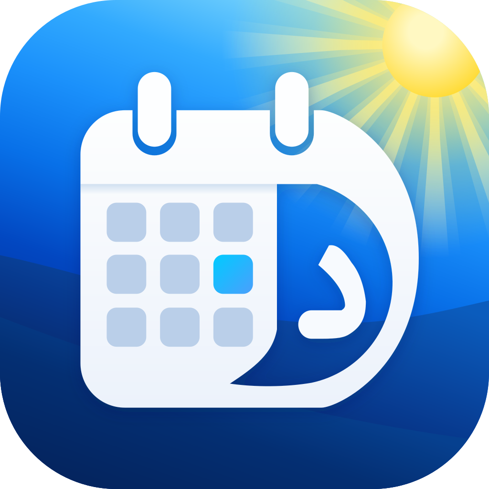

<p align="center">
  
</p>

# Day

A clock, calendar, world clock, stopwatch and timer applet for the COSMIC panel.

Disclaimer: This project started from `cosmic-applet-time` in [pop-os/cosmic-applets](https://github.com/pop-os/cosmic-applets) and is meant to replace it on the panel.

https://github.com/user-attachments/assets/538e1c30-ae5a-4c83-8c86-cc5ee417dc8f

## Features

- Clock
- Calendar
- Persian (Shamsi) calendar overlay
- World clocks with offline city search
- Stopwatch with laps
- Countdown timer

## Installation

### From Source

Build and install with [just](https://github.com/casey/just):

```sh
just && sudo just install
```

### As a Flatpak

```sh
just flatpak-build
```

## Adding Day to the panel

1. Open **Settings** > **Desktop** > **Panel** > **Applets**
2. Add **Day**
3. Remove the stock **Date, Time and Calendar** applet if you no longer want it

## Uninstall

```sh
sudo just uninstall
```

For the Flatpak:

```sh
just flatpak-uninstall
```

## Why "Day"?

Day (دی) is the 10th month of the Persian calendar. Also, it's every day of the Gregorian calendar!
